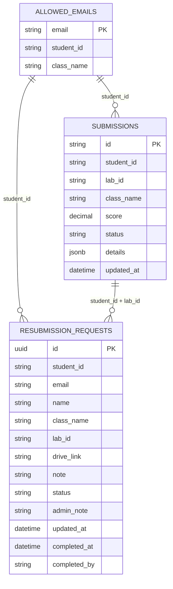
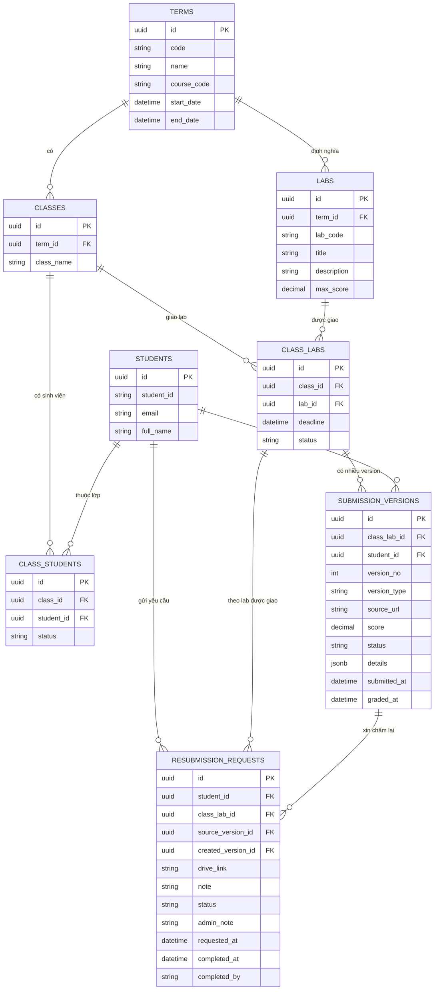

# Đặc tả hệ thống quản lý điểm chấm PRN232

## 1. Tổng quan

Hệ thống dùng để quản lý và tra cứu kết quả chấm tự động môn PRN232 theo từng lớp, từng lab, từng sinh viên và từng lần nộp/chấm lại.

Ở trạng thái hiện tại, hệ thống đã có các phần chính:

- Sinh viên đăng nhập và xem điểm/lỗi chấm của mình.
- Admin quản lý danh sách sinh viên được phép truy cập theo lớp.
- Admin xem kết quả theo lớp và lab.
- Sinh viên gửi yêu cầu nộp muộn/chấm lại.
- Admin xử lý yêu cầu nộp muộn/chấm lại.

Điểm cần lưu ý: trong ngữ cảnh hệ thống này, “đợt chấm” nên được hiểu là version/lần nộp của từng sinh viên cho một lab, không phải một lịch chấm chung cho cả lớp. Hiện tại hệ thống chưa lưu được lịch sử version này; `submissions` chỉ giữ kết quả mới nhất theo `student_id + lab_id`.

## 2. ERD cũ (legacy — superseded Phase 5, 2026-07-04)

**Lưu ý**: Mô hình này đã được thay thế bởi ERD chuẩn hóa ở Section 3. Các bảng legacy `allowed_emails`, `submissions` (flat), `resubmission_requests` (với string FK) vẫn tồn tại trong database để tương thích với code cũ cho đến Phase 7 (production stabilization), nhưng không được dùng cho code mới.

Mô hình cũ bám theo các bảng: `allowed_emails`, `submissions`, `resubmission_requests`.

### Lý do được thay thế

- `allowed_emails` đóng vai trò roster sinh viên nhưng không chuẩn hóa lớp.
- `submissions` lưu chỉ bản ghi mới nhất, không có lịch sử version.
- `class_name` và `lab_id` là chuỗi lặp lại, không được chuẩn hóa thành bảng riêng.
- Quan hệ giữa các bảng là logic (string match), không có foreign key vật lý.
- Không thể quản lý được nhiều học kỳ hoặc deadline riêng cho từng lớp.

## 3. ERD hiện tại (normalized — Phase 5, 2026-07-04)

**Lưu ý**: Mô hình chuẩn hóa này đã được triển khai từ 2026-07-04. Xem chi tiết schema, RPCs và RLS policies tại `docs/api/2026-07-04-normalize-erd-*.sql`.

Với cách hiểu “đợt chấm” là version/attempt của từng student cho một lab, mô hình tách phần giao lab cho lớp và phần lịch sử nộp/chấm của từng sinh viên.

### Lý do nên dùng mô hình đề xuất

- Quản lý được nhiều học kỳ hoặc nhiều lớp PRN232.
- Một lớp có thể có nhiều lab.
- Mỗi lab được giao cho lớp có thể có deadline riêng.
- Một sinh viên có thể có nhiều version bài nộp cho cùng một lab.
- Có thể phân biệt version chính thức, version nộp muộn, version chấm lại.
- Admin có thể xem lịch sử điểm thay vì chỉ thấy bản ghi cuối cùng.
- Có thể xuất báo cáo chính xác theo lớp, lab, version bài nộp và sinh viên.

## 4. Vai trò người dùng

### 4.1. Student

Sinh viên có thể:

- Đăng nhập bằng tài khoản Google đã được cấp quyền.
- Xem thông tin cá nhân: họ tên, email, MSSV, lớp.
- Xem danh sách lab đã có điểm hoặc đang thiếu bài.
- Xem điểm, trạng thái và thời gian cập nhật của từng lab.
- Xem chi tiết testcase, log build, lỗi và response thực tế.
- Gửi yêu cầu nộp muộn/chấm lại bằng link Google Drive.
- Theo dõi trạng thái xử lý yêu cầu nộp muộn/chấm lại.

### 4.2. Admin

Admin có thể:

- Quản lý danh sách sinh viên được phép truy cập.
- Thêm, sửa, xóa sinh viên trong whitelist.
- Import danh sách sinh viên từ CSV.
- Xem kết quả theo lớp và lab.
- Xem thống kê số lượng đã nộp, chưa nộp, passed, failed, grading.
- Duyệt, từ chối hoặc đánh dấu hoàn tất yêu cầu nộp muộn/chấm lại.

### 4.3. Teacher

Vai trò teacher đã có route và phân quyền cơ bản, nhưng dashboard chưa có nghiệp vụ thực tế. Hiện tại teacher chưa có chức năng riêng ngoài đăng nhập và điều hướng.

## 5. Chức năng chính

### 5.1. Đăng nhập và phân quyền

- Hệ thống sử dụng Google login.
- Sau khi đăng nhập, người dùng được điều hướng theo role:
  - `ROLE_ADMIN` vào `/admin/terms` (hierarchy: terms → classes → labs → students).
  - `ROLE_STUDENT` vào `/student/dashboard` hoặc `/student/labs/[classLabId]` (list attempts).
  - `ROLE_TEACHER` vào `/teacher/dashboard`.
- Student chỉ xem được dữ liệu của chính mình (cơ chế RLS trên `submissions`).
- Admin được thao tác trên dữ liệu quản trị thông qua các server actions.

### 5.2. Quản lý sinh viên theo lớp

**Cách mới (Phase 5, 2026-07-04)**: Hệ thống dùng cấu trúc `students` + `class_students` + `terms` + `classes` thay cho flat `allowed_emails`:

- `students` lưu student metadata (email, student_id, full_name).
- `class_students` liên kết student với class cụ thể (với status).
- `classes` được tổ chức theo `terms`, cho phép quản lý nhiều học kỳ.

**Chức năng**:

- Thêm mới student vào class (hoặc import CSV).
- Cập nhật status của student trong class.
- Xóa student khỏi class (soft-delete qua status).
- Quản lý theo học kỳ (term) và lớp (class).

**Mục đích**:

- Ràng buộc sinh viên nào được phép truy cập hệ thống.
- Cấu trúc hóa sinh viên theo học kỳ và lớp.
- Cung cấp roster chuẩn để tính số lượng đã nộp/chưa nộp theo lớp.
- Hỗ trợ nhiều học kỳ/năm học cùng lúc.

**Chú ý**: Bảng cũ `allowed_emails` (flat) vẫn có trong DB nhưng không được dùng cho code mới.

### 5.3. Xem kết quả theo lớp và lab

**Cách mới (Phase 5, 2026-07-04)**: Admin điều hướng qua cấu trúc dạng cây: `/admin/terms` → `/admin/terms/[termId]/classes` → `/admin/terms/[termId]/classes/[classId]/labs` → `/admin/terms/[termId]/classes/[classId]/labs/[classLabId]/students` (hiển thị kết quả).

**Công dụng**:

- Chọn học kỳ (term).
- Chọn lớp trong học kỳ đó.
- Chọn lab được giao cho lớp.
- Xem bảng kết quả của từng sinh viên trong lớp cho lab đã chọn.

**Mỗi dòng kết quả gồm**:

- Email.
- MSSV.
- Tên sinh viên.
- Điểm.
- Trạng thái gốc từ hệ thống chấm.
- Trạng thái quy đổi.
- Số lần nộp (attempt_no).
- Thời điểm cập nhật gần nhất.

**Trạng thái quy đổi**:

- Không có submission: `Not Submitted`.
- `grading` hoặc `pending`: `Grading`.
- Có điểm và điểm >= 5: `Passed`.
- Còn lại: `Failed`.

**Thống kê tổng hợp** (RPC `admin_class_lab_student_results`):

- Tổng sinh viên trong lớp.
- Số sinh viên đã nộp.
- Số sinh viên chưa nộp.
- Số passed.
- Số failed.
- Số grading.
- Điểm trung bình của nhóm đã nộp.

### 5.4. Sinh viên tra cứu kết quả

**Cách mới (Phase 5, 2026-07-04)**: Student sử dụng `/student/labs/[classLabId]` để xem danh sách attempts, sau đó chọn attempt cụ thể để xem chi tiết tại `/student/labs/[classLabId]/submissions/[submissionId]`.

**Chức năng**:

- Xem danh sách lab của riêng mình (dựa trên class_students).
- Xem danh sách attempts (versions) cho mỗi lab (keyed by `attempt_no`).
- Chọn attempt để xem chi tiết:
  - Số testcase passed/total.
  - Build logs.
  - Response thực tế.
  - HTTP status code nếu testcase có gọi API.
  - Lỗi chi tiết nếu testcase fail.
- Gửi yêu cầu nộp muộn/chấm lại từ giao diện chi tiết submission.

**Hiển thị lab chưa nộp**: Nếu sinh viên chưa có submission cho một lab nhưng lớp đã có dữ liệu lab đó, hệ thống vẫn hiển thị lab ở trạng thái chưa nộp (thông qua RPC `student_class_lab_overview`).

### 5.5. Nộp muộn và chấm lại

Sinh viên có thể gửi yêu cầu nộp muộn/chấm lại qua dialog `AttemptResubmissionDialog` (Phase 5) hoặc RPC `create_resubmission_request`.

**Schema mới (`resubmission_requests_v2`)**:

- `id` (uuid PK)
- `submission_id` (uuid FK → `submissions`)
- `drive_link`
- `note`
- `status` ('pending' | 'approved' | 'rejected' | 'completed')
- `admin_note`
- `requested_at`
- `completed_at`
- `completed_by`

**So sánh với cũ**: Cách mới dùng FK vật lý đến `submissions` thay cho string match trên `student_id`, `email`, `class_name`, `lab_id`.

Luồng xử lý:

1. Sinh viên nhập `lab_id` và link Google Drive.
2. Hệ thống kiểm tra link phải là Google Drive hợp lệ.
3. Hệ thống giới hạn thao tác: 60 giây giữa hai lần tạo/cập nhật yêu cầu.
4. Hệ thống giới hạn tối đa 5 thao tác với yêu cầu `pending` trong 1 giờ.
5. Nếu lab đã có yêu cầu `approved`, sinh viên không được tạo thêm yêu cầu mới.
6. Nếu đã có yêu cầu `pending` cùng sinh viên và cùng lab, hệ thống cập nhật yêu cầu cũ.
7. Nếu chưa có, hệ thống tạo yêu cầu mới với trạng thái `pending`.
8. Hệ thống gửi thông báo Discord cho admin.

Trạng thái yêu cầu:

- `pending`: chờ admin xử lý.
- `approved`: đã được chấp nhận, chờ xử lý hoàn tất.
- `rejected`: bị từ chối.
- `completed`: đã xử lý xong.

Admin có thể:

- Xem danh sách request.
- Lọc theo trạng thái.
- Tìm theo MSSV, email, lớp hoặc lab.
- Approve request.
- Reject request và bắt buộc ghi lý do.
- Mark completed sau khi đã xử lý xong ngoài hệ thống chấm.

## 6. Quy tắc nghiệp vụ

### 6.1. Quy tắc truy cập

- **Student access**: Email phải tồn tại trong bảng `class_students` (thông qua `students`) để được phép đăng nhập + sử dụng hệ thống. RLS policies trên `submissions` giới hạn student chỉ xem dữ liệu của chính mình dựa trên `student_id`.
- **Admin access**: Chỉ role `ROLE_ADMIN` mới gọi được các server action quản trị. RPC `create_resubmission_request` kiểm tra `auth.uid()`.
- **Data isolation**: Dữ liệu student được giới hạn theo `student_id` từ JWT token + RLS policy trên `submissions`.

### 6.2. Quy tắc xác định lab chưa nộp

Lab chưa nộp của một student được tính như sau (RPC `student_class_lab_overview`):

- Lấy danh sách `class_labs` của lớp mà student đó thuộc (thông qua `class_students`).
- Lấy danh sách `submissions` của student trong các `class_labs` đó.
- Phần chênh lệch là danh sách lab student còn thiếu.

Quy tắc này giúp hệ thống hiển thị các lab còn thiếu dù student chưa có submission (status = `Not Submitted`).

### 6.3. Quy tắc đánh giá kết quả

- Hệ thống hiện tại dùng ngưỡng điểm 5.0 để phân biệt `Passed` và `Failed`.
- Nếu status nguồn là `grading` hoặc `pending`, hệ thống ưu tiên hiển thị `Grading`.
- Hệ thống chưa có rubric nhiều mức như Excellent, Good hoặc Retry.

### 6.4. Quy tắc import CSV student roster

**Schema mới (Phase 5, 2026-07-04)**: CSV import sẽ xử lý:

- Tìm hoặc tạo `student` record (email, student_id).
- Tìm hoặc tạo `class` record (dựa trên class_name + term_id).
- Tạo hoặc cập nhật `class_students` record (student → class, status = active).

**Cột CSV cần có**:

- `email`
- `student_id` hoặc alias tương đương
- `class_name` hoặc alias tương đương
- (optional) `full_name`
- (optional) `term_code` (mặc định dùng current term)

**Hành động**:

- Chuẩn hóa email về lowercase.
- Chuẩn hóa MSSV và lớp về uppercase.
- Bỏ qua dòng không hợp lệ.
- Upsert: nếu student + class đã tồn tại, cập nhật status. Nếu chưa, tạo mới.

## 7. Màn hình chức năng (Phase 5, 2026-07-04)

### 7.1. Student Views

**`/student/labs/[classLabId]`** — Danh sách attempts:
- Thông tin lab (title, description, max_score).
- Danh sách attempts (versions) với status, score, updated_at.
- Nút `View Details` để xem chi tiết submission.

**`/student/labs/[classLabId]/submissions/[submissionId]`** — Chi tiết submission:
- Thông tin submission (score, status, attempt_no).
- Danh sách testcases (passed/total, execution time, etc.).
- Build logs.
- Response thực tế từ testcase.
- HTTP status code (nếu có).
- Lỗi chi tiết (nếu testcase fail).
- Dialog `AttemptResubmissionDialog` để gửi yêu cầu nộp muộn/chấm lại.

### 7.2. Admin Views

**`/admin/terms`** — Danh sách học kỳ:
- Danh sách term (code, name, date range).
- Nút để vào từng term.

**`/admin/terms/[termId]/classes`** — Danh sách lớp:
- Danh sách class trong term.
- Nút để vào từng class.

**`/admin/terms/[termId]/classes/[classId]/labs`** — Danh sách lab:
- Danh sách lab được giao cho class.
- Nút để xem kết quả chi tiết.

**`/admin/terms/[termId]/classes/[classId]/labs/[classLabId]/students`** — Kết quả chi tiết:
- Bảng kết quả từng sinh viên trong lớp cho lab.
- Thống kê tổng hợp (RPC `admin_class_lab_student_results`).
- Cột: Email, MSSV, Tên, Điểm, Trạng thái, Attempt, Updated.

### 7.3. Teacher Dashboard

- Đã tồn tại route `/teacher/dashboard`.
- Chưa có nghiệp vụ chi tiết (dành cho future phase).

## 8. Bảo mật và kiểm soát

- Đăng nhập qua Google.
- Phân quyền theo role.
- Server action kiểm tra admin trước khi thao tác dữ liệu quản trị.
- Student chỉ lấy điểm theo `student_id` của chính mình.
- Nên dùng Row Level Security của Supabase để tăng cường bảo vệ dữ liệu `submissions`.

## 9. Tích hợp ngoài

Hệ thống hiện tại có các tích hợp chính:

- Google Auth cho đăng nhập.
- Supabase để lưu và tra cứu dữ liệu.
- Discord webhook để thông báo request nộp lại/chấm lại.

## 10. Giới hạn hiện tại (Phase 5, 2026-07-04)

**Đã giải quyết (Phase 5)**:
- ✅ Bảng master cho học kỳ: `terms`.
- ✅ Bảng master cho lớp: `classes` (FK → `terms`).
- ✅ Bảng giao lab cho lớp: `class_labs` (FK → `classes`, `labs`).
- ✅ Entity `Labs` với metadata (code, title, description, max_score).
- ✅ Lịch sử nhiều lần nộp: `submissions.attempt_no` + RPC `admin_class_lab_student_results`, `student_class_lab_overview`.

**Chưa giải quyết**:
- Chưa có dashboard teacher thực tế.
- Chưa có quy trình tự động đồng bộ trạng thái `completed` với công cụ chấm bên ngoài.
- Chưa có chức năng xuất báo cáo (CSV, PDF).
- Chưa có rubric nhiều mức (Excellent, Good, Retry).
- Chưa có integration công cụ chấm tự động khác (hiện tại fetch dữ liệu từ submissions table được populate từ bên ngoài).

## 11. Kết luận

Ở trạng thái hiện tại (Phase 5, 2026-07-04), hệ thống là cổng quản lý và tra cứu điểm chấm PRN232 với trọng tâm là:

- **Chuẩn hóa dữ liệu**: Roster sinh viên theo học kỳ + lớp (normalized schema: `terms` → `classes` → `students` / `class_students`).
- **Quản lý lý trưởng**: Lab master per term, giao lab cho từng lớp với deadline riêng (`class_labs`).
- **Lịch sử submission**: Hỗ trợ multiple attempts per student per class_lab (`submissions.attempt_no`).
- **Tra cứu chi tiết**: Admin/Student xem chi tiết submission theo cây: terms → classes → labs → students/attempts.
- **Xử lý exception**: Yêu cầu nộp muộn/chấm lại qua `resubmission_requests_v2` (FK vật lý).

**Mô hình cũ** (flat `allowed_emails`/`submissions`/`resubmission_requests`) vẫn tồn tại trong DB nhưng đã được supersede bởi schema chuẩn hóa. Giữ lại cho migration safety cho đến Phase 7.
