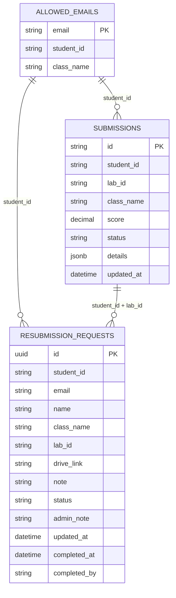
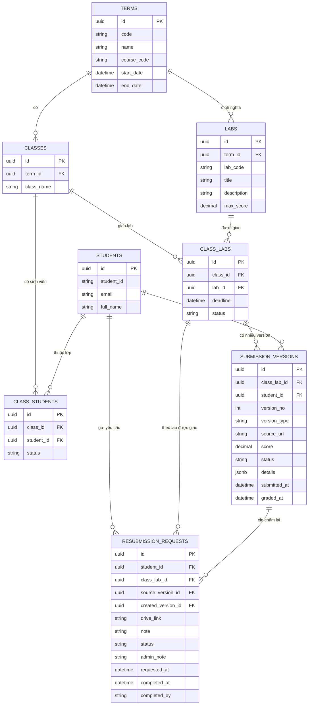

# Đặc tả hệ thống quản lý điểm chấm PRN232

## 1. Tổng quan

Hệ thống dùng để quản lý và tra cứu kết quả chấm tự động môn PRN232 theo từng lớp, từng lab, từng sinh viên và từng lần nộp/chấm lại.

Ở trạng thái hiện tại, hệ thống đã có các phần chính:

- Sinh viên đăng nhập và xem điểm/lỗi chấm của mình.
- Admin quản lý danh sách sinh viên được phép truy cập theo lớp.
- Admin xem kết quả theo lớp và lab.
- Sinh viên gửi yêu cầu nộp muộn/chấm lại.
- Admin xử lý yêu cầu nộp muộn/chấm lại.

Điểm cần lưu ý: trong ngữ cảnh hệ thống này, “đợt chấm” nên được hiểu là version/lần nộp của từng sinh viên cho một lab, không phải một lịch chấm chung cho cả lớp. Hiện tại hệ thống chưa lưu được lịch sử version này; `submissions` chỉ giữ kết quả mới nhất theo `student_id + lab_id`.

## 2. ERD hiện tại theo code

Mô hình hiện tại bám theo các bảng đang được frontend sử dụng: `allowed_emails`, `submissions`, `resubmission_requests`.

### Giải thích mô hình hiện tại

- `allowed_emails` đóng vai trò roster sinh viên: email, MSSV và lớp.
- `submissions` lưu kết quả chấm theo từng sinh viên và từng lab.
- `resubmission_requests` lưu yêu cầu nộp muộn/chấm lại của sinh viên.
- `class_name` và `lab_id` đang là chuỗi lặp lại trong nhiều bảng, chưa được chuẩn hóa thành bảng riêng.
- Quan hệ giữa các bảng hiện là quan hệ logic theo `student_id`, `class_name`, `lab_id`, chưa chắc đã có foreign key vật lý trong database.

## 3. ERD đề xuất để quản lý đúng theo lớp, lab, version bài nộp và student

Với cách hiểu “đợt chấm” là version bài nộp của từng student, mô hình nên tách phần giao lab cho lớp và phần lịch sử nộp/chấm của từng sinh viên.

### Lý do nên dùng mô hình đề xuất

- Quản lý được nhiều học kỳ hoặc nhiều lớp PRN232.
- Một lớp có thể có nhiều lab.
- Mỗi lab được giao cho lớp có thể có deadline riêng.
- Một sinh viên có thể có nhiều version bài nộp cho cùng một lab.
- Có thể phân biệt version chính thức, version nộp muộn, version chấm lại.
- Admin có thể xem lịch sử điểm thay vì chỉ thấy bản ghi cuối cùng.
- Có thể xuất báo cáo chính xác theo lớp, lab, version bài nộp và sinh viên.

## 4. Vai trò người dùng

### 4.1. Student

Sinh viên có thể:

- Đăng nhập bằng tài khoản Google đã được cấp quyền.
- Xem thông tin cá nhân: họ tên, email, MSSV, lớp.
- Xem danh sách lab đã có điểm hoặc đang thiếu bài.
- Xem điểm, trạng thái và thời gian cập nhật của từng lab.
- Xem chi tiết testcase, log build, lỗi và response thực tế.
- Gửi yêu cầu nộp muộn/chấm lại bằng link Google Drive.
- Theo dõi trạng thái xử lý yêu cầu nộp muộn/chấm lại.

### 4.2. Admin

Admin có thể:

- Quản lý danh sách sinh viên được phép truy cập.
- Thêm, sửa, xóa sinh viên trong whitelist.
- Import danh sách sinh viên từ CSV.
- Xem kết quả theo lớp và lab.
- Xem thống kê số lượng đã nộp, chưa nộp, passed, failed, grading.
- Duyệt, từ chối hoặc đánh dấu hoàn tất yêu cầu nộp muộn/chấm lại.

### 4.3. Teacher

Vai trò teacher đã có route và phân quyền cơ bản, nhưng dashboard chưa có nghiệp vụ thực tế. Hiện tại teacher chưa có chức năng riêng ngoài đăng nhập và điều hướng.

## 5. Chức năng chính

### 5.1. Đăng nhập và phân quyền

- Hệ thống sử dụng Google login.
- Sau khi đăng nhập, người dùng được điều hướng theo role:
- `ROLE_ADMIN` vào `/admin/dashboard`.
- `ROLE_STUDENT` vào `/student/dashboard`.
- `ROLE_TEACHER` vào `/teacher/dashboard`.
- Student chỉ xem được dữ liệu của chính mình.
- Admin được thao tác trên dữ liệu quản trị.

### 5.2. Quản lý sinh viên theo lớp

Hệ thống duy trì bảng `allowed_emails` gồm:

- `email`
- `student_id`
- `class_name`

Chức năng:

- Tìm kiếm theo email, MSSV hoặc lớp.
- Lọc theo lớp.
- Thêm mới sinh viên.
- Cập nhật MSSV/lớp của sinh viên.
- Xóa sinh viên khỏi danh sách truy cập.
- Import CSV để cập nhật roster hàng loạt.

Mục đích:

- Ràng buộc sinh viên nào được phép đăng nhập.
- Xác định sinh viên thuộc lớp nào.
- Cung cấp roster chuẩn để tính số lượng đã nộp/chưa nộp theo lớp.

### 5.3. Xem kết quả theo lớp và lab

Admin có thể:

- Chọn lớp.
- Xem danh sách lab có dữ liệu trong lớp đó.
- Chọn một lab cụ thể.
- Xem bảng kết quả của từng sinh viên trong lớp theo lab đã chọn.

Mỗi dòng kết quả gồm:

- Email.
- MSSV.
- Lớp.
- Lab.
- Điểm.
- Trạng thái gốc từ hệ thống chấm.
- Trạng thái quy đổi.
- Thời điểm cập nhật gần nhất.

Trạng thái quy đổi hiện tại:

- Không có submission: `Not Submitted`.
- `grading` hoặc `pending`: `Grading`.
- Có điểm và điểm >= 5: `Passed`.
- Còn lại: `Failed`.

Thống kê tổng hợp:

- Tổng sinh viên trong lớp.
- Số sinh viên đã nộp.
- Số sinh viên chưa nộp.
- Số passed.
- Số failed.
- Số grading.
- Điểm trung bình của nhóm đã nộp.

### 5.4. Sinh viên tra cứu kết quả

Student dashboard cho phép sinh viên:

- Xem danh sách lab của riêng mình.
- Chọn lab để xem chi tiết lần chấm hiện tại.
- Xem số testcase passed/total.
- Xem build logs.
- Xem response thực tế.
- Xem HTTP status code nếu testcase có gọi API.
- Xem lỗi chi tiết nếu testcase fail.

Nếu sinh viên chưa có submission cho một lab nhưng lớp đã có dữ liệu lab đó, hệ thống vẫn hiển thị lab ở trạng thái chưa nộp để sinh viên biết mình đang thiếu bài.

### 5.5. Nộp muộn và chấm lại

Sinh viên có thể gửi yêu cầu nộp muộn/chấm lại qua `resubmission_requests`.

Dữ liệu một yêu cầu gồm:

- `student_id`
- `email`
- `name`
- `class_name`
- `lab_id`
- `drive_link`
- `note`
- `status`
- `admin_note`
- `updated_at`
- `completed_at`
- `completed_by`

Luồng xử lý:

1. Sinh viên nhập `lab_id` và link Google Drive.
2. Hệ thống kiểm tra link phải là Google Drive hợp lệ.
3. Hệ thống giới hạn thao tác: 60 giây giữa hai lần tạo/cập nhật yêu cầu.
4. Hệ thống giới hạn tối đa 5 thao tác với yêu cầu `pending` trong 1 giờ.
5. Nếu lab đã có yêu cầu `approved`, sinh viên không được tạo thêm yêu cầu mới.
6. Nếu đã có yêu cầu `pending` cùng sinh viên và cùng lab, hệ thống cập nhật yêu cầu cũ.
7. Nếu chưa có, hệ thống tạo yêu cầu mới với trạng thái `pending`.
8. Hệ thống gửi thông báo Discord cho admin.

Trạng thái yêu cầu:

- `pending`: chờ admin xử lý.
- `approved`: đã được chấp nhận, chờ xử lý hoàn tất.
- `rejected`: bị từ chối.
- `completed`: đã xử lý xong.

Admin có thể:

- Xem danh sách request.
- Lọc theo trạng thái.
- Tìm theo MSSV, email, lớp hoặc lab.
- Approve request.
- Reject request và bắt buộc ghi lý do.
- Mark completed sau khi đã xử lý xong ngoài hệ thống chấm.

## 6. Quy tắc nghiệp vụ

### 6.1. Quy tắc truy cập

- Chỉ email nằm trong danh sách được cấp quyền mới nên được phép sử dụng hệ thống student.
- Dữ liệu student được giới hạn theo `student_id` trong token/xác thực.
- Admin phải có role admin mới gọi được các server action quản trị.

### 6.2. Quy tắc xác định lab chưa nộp

Lab chưa nộp của một student được tính như sau:

- Lấy danh sách `lab_id` đã tồn tại trong `submissions` của cả lớp.
- Lấy danh sách `lab_id` mà student đã có submission.
- Phần chênh lệch là danh sách lab student còn thiếu.

Quy tắc này giúp hệ thống hiển thị các lab còn thiếu dù student chưa có điểm.

### 6.3. Quy tắc đánh giá kết quả

- Hệ thống hiện tại dùng ngưỡng điểm 5.0 để phân biệt `Passed` và `Failed`.
- Nếu status nguồn là `grading` hoặc `pending`, hệ thống ưu tiên hiển thị `Grading`.
- Hệ thống chưa có rubric nhiều mức như Excellent, Good hoặc Retry.

### 6.4. Quy tắc import CSV whitelist

CSV cần có các cột tương ứng:

- `email`
- `student_id` hoặc alias tương đương
- `class_name` hoặc alias tương đương

Hệ thống sẽ:

- Chuẩn hóa email về lowercase.
- Chuẩn hóa MSSV và lớp về uppercase.
- Bỏ qua dòng không hợp lệ.
- Gộp bản ghi trùng email theo cơ chế upsert.

## 7. Màn hình chức năng

### 7.1. Student Dashboard

Khu vực chính:

- Thông tin sinh viên.
- Danh sách lab.
- Panel chi tiết kết quả chấm.
- Khu vực logs/testcases.
- Dialog gửi yêu cầu nộp muộn/chấm lại.

### 7.2. Admin Dashboard

Khu vực chính:

- `Resubmit Requests`
- `Student Access`
- `Student Results`

### 7.3. Teacher Dashboard

- Đã tồn tại route.
- Chưa có nghiệp vụ chi tiết.

## 8. Bảo mật và kiểm soát

- Đăng nhập qua Google.
- Phân quyền theo role.
- Server action kiểm tra admin trước khi thao tác dữ liệu quản trị.
- Student chỉ lấy điểm theo `student_id` của chính mình.
- Nên dùng Row Level Security của Supabase để tăng cường bảo vệ dữ liệu `submissions`.

## 9. Tích hợp ngoài

Hệ thống hiện tại có các tích hợp chính:

- Google Auth cho đăng nhập.
- Supabase để lưu và tra cứu dữ liệu.
- Discord webhook để thông báo request nộp lại/chấm lại.

## 10. Giới hạn hiện tại

- Chưa có bảng master để quản lý học kỳ và lab được giao cho từng lớp.
- Chưa có entity riêng cho `Lab` với metadata đầy đủ.
- Chưa có dashboard teacher thực tế.
- Chưa có quy trình tự động đồng bộ trạng thái `completed` với công cụ chấm bên ngoài.
- Chưa có lịch sử nhiều lần nộp/chấm rõ ràng trong model hiện tại.
- Chưa có chức năng xuất báo cáo.

## 11. Kết luận

Ở trạng thái hiện tại, hệ thống là cổng quản lý và tra cứu điểm chấm PRN232 với trọng tâm là:

- Roster sinh viên theo lớp.
- Kết quả chấm theo lab.
- Tra cứu chi tiết theo sinh viên.
- Xử lý các trường hợp nộp muộn/chấm lại.

Nếu muốn hệ thống quản lý đúng theo từng lớp, từng lab, từng version bài nộp và từng student, nên nâng mô hình dữ liệu sang ERD đề xuất ở phần 3. Khi đó `submissions` hiện tại nên được tách thành `class_labs` và `submission_versions` để lưu được lịch sử từng lần nộp/chấm.
